# Projeto Final - TDD/BDD/ATDD em Spring Boot

## Integrantes
- Felipe
- Isadora
- Maria Julia

## Link do Repositório no GitHub
- `https://github.com/<usuario>/<repositorio>`

## Contexto da Entrega
Projeto da disciplina com foco em **Educação Continuada Gamificada**, aplicando:
- TDD (RED -> GREEN -> BLUE)
- BDD (cenários por história de usuário)
- ATDD (evidências de aceitação via endpoints)

### Cronograma da Atividade
- 01/09: início da atividade
- 08/09: desenvolvimento em aula
- 14/09: entrega final (turmas 1 e 2)

## Estudo de Caso
- Tema: **Educação Continuada Gamificada**.
- Objetivo: implementar regras de engajamento de alunos com bônus de cursos, recompensas por participação em fórum e progressão para plano Premium.

## Tecnologias Utilizadas
### Backend
- Java 17
- Spring Boot
- Spring Web
- Spring Data JPA
- Maven
- Swagger / OpenAPI

### Banco de Dados
- H2 Database
- PostgreSQL
- PgAdmin

### Frontend
- Vue.js
- Vite
- Nginx

### Infraestrutura
- Docker
- Docker Compose

## Estrutura da Aplicação
Camadas implementadas:
- `domain`: regras de negócio puras
- `entity`: mapeamento JPA
- `repository`: acesso a dados
- `service`: orquestração de regras + persistência
- `dto`: contratos de entrada/saída
- `controller`: endpoints REST

Pacotes principais:
- `src/main/java/org/example/tdd/domain`
- `src/main/java/org/example/tdd/entity`
- `src/main/java/org/example/tdd/repository`
- `src/main/java/org/example/tdd/service`
- `src/main/java/org/example/tdd/dto`
- `src/main/java/org/example/tdd/controller`

## Histórias de Usuário (US)

### US1 - Desempenho Acadêmico (Isadora)
Como aluno, quero receber cursos liberados ao concluir uma disciplina com média acima de 7, para avançar na plataforma.

### US2 - Participação no Fórum (Maria Julia)
Como aluno, quero receber recompensa quando tiver maior participação qualificada no fórum, para ser incentivado a colaborar com a turma.

### US3 - Evolução para Plano Premium (Felipe)
Como aluno, quero migrar para plano Premium ao atingir 12 cursos liberados, para obter benefícios extras.

## BDD por Integrante

### Isadora (US1)
Cenários BDD escritos:
- Dado um aluno com média maior que 7, quando concluir curso, então deve liberar 3 cursos.
- Dado um aluno com média igual a 7, quando concluir curso, então não deve liberar cursos.
- Dado um aluno com média menor que 7, quando concluir curso, então não deve liberar cursos.

### Maria Julia (US2)
Cenários BDD escritos:
- Dado um aluno que criou mais tópicos que os demais e ajudou com comentários, quando recompensar participação, então deve liberar 1 curso.
- Dado um aluno que não criou mais tópicos que os demais, quando recompensar participação, então não deve liberar curso.
- Dado um aluno sem comentários de ajuda, quando recompensar participação, então não deve liberar curso.

### Felipe (US3)
Cenários BDD escritos:
- Dado um aluno com 12 cursos liberados, quando verificar plano, então deve se tornar Premium.
- Dado um aluno Premium, quando verificar benefícios, então deve receber voucher e 3 moedas.
- Dado um aluno com menos de 12 cursos, quando verificar plano, então deve permanecer no plano Básico.

## TDD - Evidências RED/GREEN/BLUE

### US1
- RED: 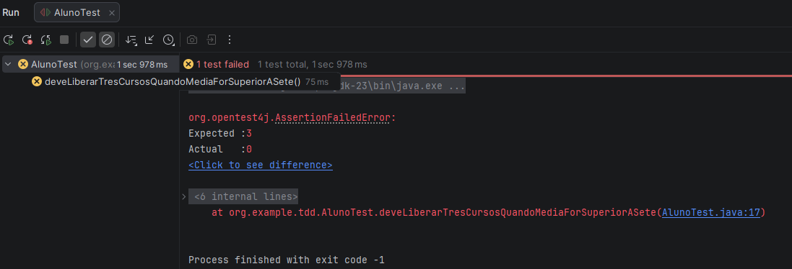
- BLUE (refatoração com testes passando): 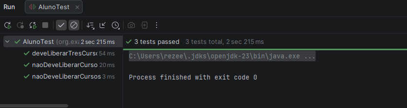

### US2
- RED: 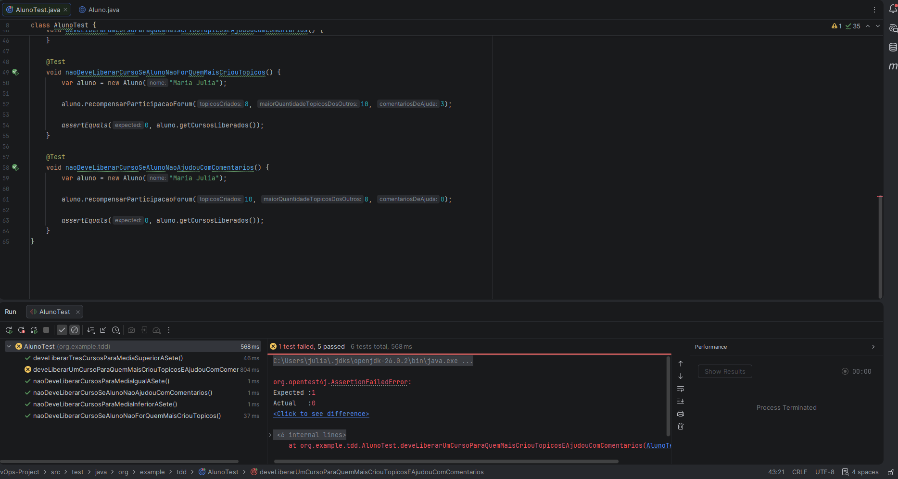
- GREEN: 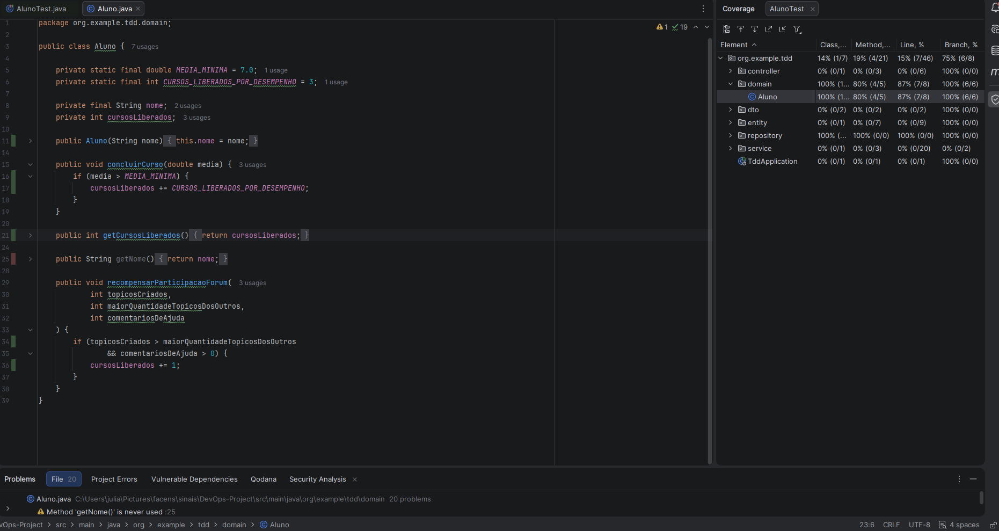
- BLUE: 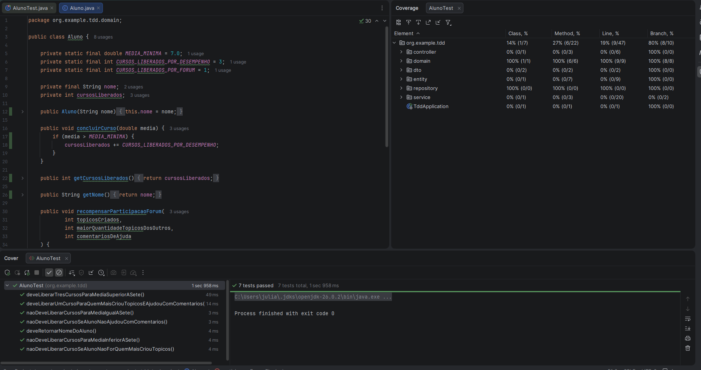

### US3
- RED: 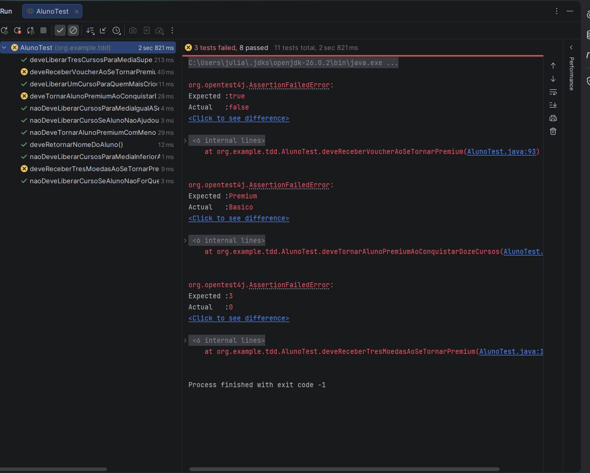
- GREEN: 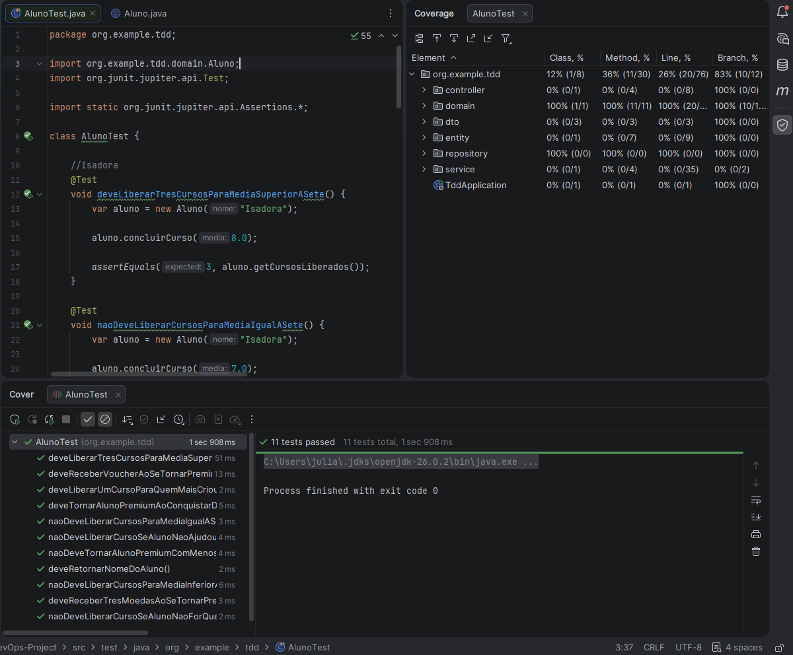
- BLUE: 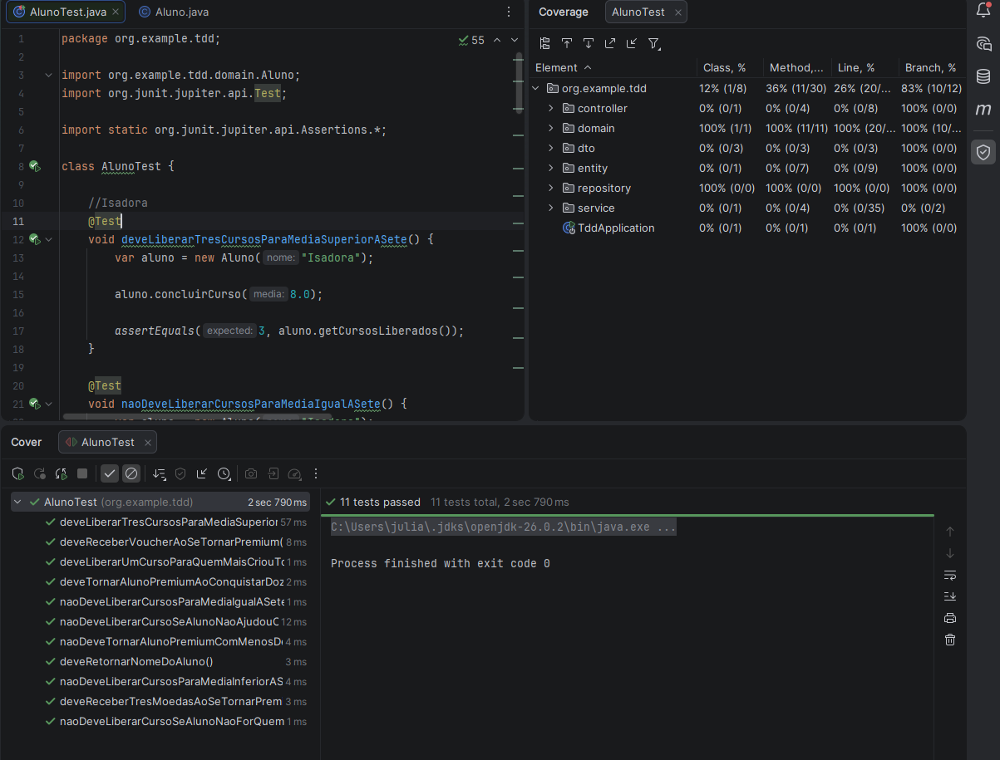

## ATDD - Evidências de Aceitação
Validação por execução de endpoints e resultado esperado de negócio.

- Criação de aluno (US2): 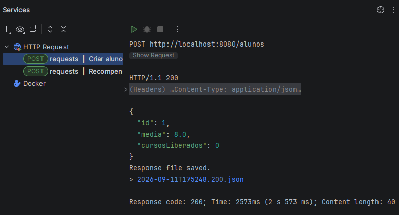
- Recompensa por fórum (US2): 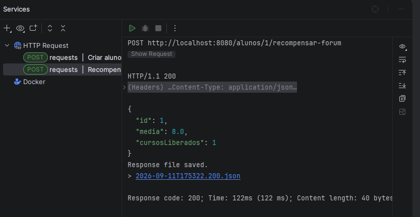
- Verificação plano Premium (US3): 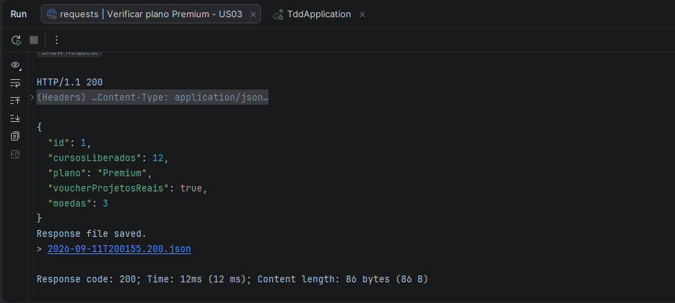

## API e Swagger
- Endpoints documentados via Swagger:
  - 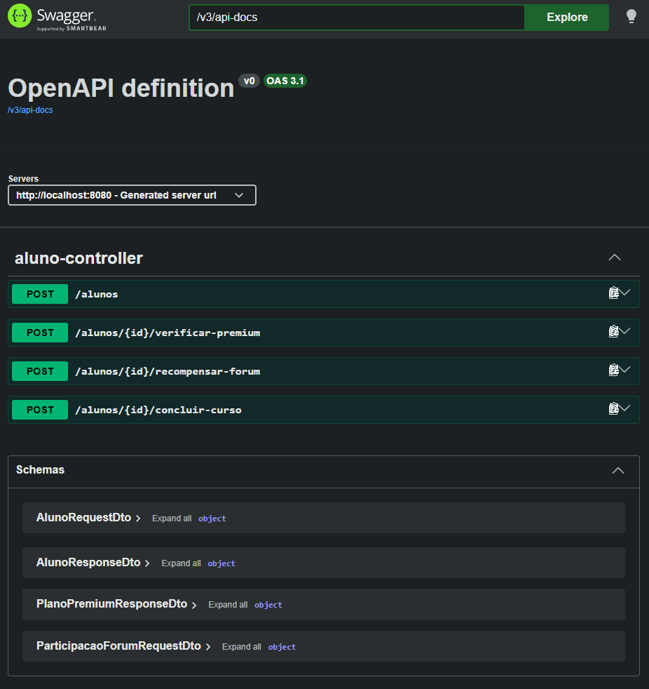
  - 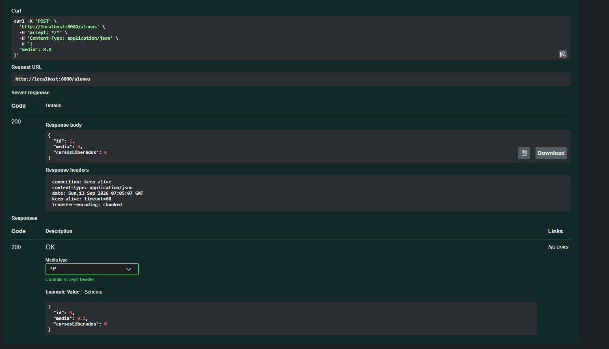
- URL local esperada:
  - `http://localhost:8080/swagger-ui/index.html`

## Endpoints Principais
- `POST /alunos` -> cria aluno
- `POST /alunos/{id}/concluir-curso` -> aplica regra de desempenho
- `POST /alunos/{id}/recompensar-forum` -> aplica regra de participação
- `POST /alunos/{id}/verificar-premium` -> valida elegibilidade Premium

Exemplo rápido (`requests.http`):
```http
POST http://localhost:8080/alunos
Content-Type: application/json

{
  "media": 8.0
}
```

## Banco de Dados

### H2
- Console habilitado em `http://localhost:8080/h2-console`
- Evidência: 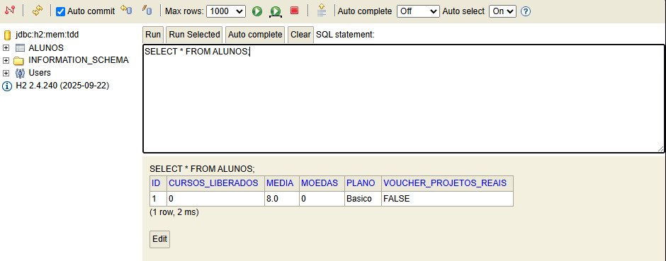

### PostgreSQL + PgAdmin
- Dependência PostgreSQL configurada no projeto.
- Executar com Docker Compose para gerar evidência:
  - `docker compose up --build -d`
  - PgAdmin: `http://localhost:5050` (`admin@tdd.com` / `admin123`)
  - PostgreSQL: `localhost:5432` (`database=tdd`, `user=tdd`, `password=tdd123`)
- Evidência solicitada: adicionar print do PgAdmin conectado ao banco `tdd`.

## Execução do Projeto

### Rodar localmente
```bash
./mvnw spring-boot:run
```
No Windows (PowerShell):
```powershell
.\mvnw.cmd spring-boot:run
```

### Rodar testes
```bash
./mvnw test
```
No Windows (PowerShell):
```powershell
.\mvnw.cmd test
```

## Execução com Docker

A aplicação completa foi containerizada utilizando Docker Compose.

O ambiente possui quatro serviços:

- `tdd-app`: backend Spring Boot
- `tdd-frontend`: frontend Vue.js servido pelo Nginx
- `tdd-postgres`: banco PostgreSQL
- `tdd-pgadmin`: administração do PostgreSQL via PgAdmin

### Pré-requisito

Ter o Docker Desktop instalado e em execução.

### Subir a aplicação completa

Na raiz do projeto:

```bash
docker compose up --build -d

## Front-end VueJS
Requisito da atividade:
- Implementar front-end em VueJS consumindo os endpoints da API.

Implementação realizada em `frontend/` com:
- criação de aluno
- conclusão de curso
- recompensa por fórum
- verificação de plano Premium

Rodar front-end:
```bash
cd frontend
npm install
npm run dev
```

URL local:
- `http://localhost:5173`

## Planilha
- Se utilizada, anexar no repositório e referenciar aqui:
  - `planilha/<nome-da-planilha>.xlsx`

## Checklist de Entrega
- [ ] Link do Git postado no Canvas
- [x] Projeto Spring Boot no GitHub
- [x] Evidências de TDD (RED/GREEN/BLUE)
- [x] Evidências de ATDD (execução de endpoints)
- [x] Swagger com endpoints
- [x] Evidência H2
- [ ] Evidência PostgreSQL/PgAdmin via container
- [x] Dockerfile e docker-compose
- [x] Front-end VueJS
- [ ] Planilha (se houver)

